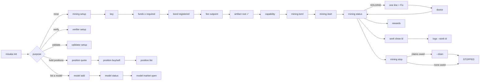

# ADR-0122 — Mining is a purpose: an operator runs one command and reads one work id

* Status: PROPOSED 2026-09-12 on `feat/adr-0122-operator-ux`, at the operator's request: turn PALW
  mining from a set of components into a product ("マイニング 検証を立てる やモデル追加 モデルポジション
  などの使いやすさをこのように引き上げて"). The request came with a proposed shape (purpose-level
  verbs, a per-work state machine, human errors, one-command start, structured logs, a dashboard,
  a wizard) and a priority order, ① to ⑧, which §9 follows. **Consensus-inert:** no consensus object,
  rule, parameter, fence or fingerprint moves. Everything here is the CLI, three additive RPC reads,
  and log lines. Existing commands, flags and log lines keep working as they are today.
* Builds on: the `misaka palw claim` reader (its `state`/`meaning`/`next` rows are §3's chain half),
  `getPalwProducerFacts` (ADR-0042 D6, and its `not_ready_reason`), the retention janitor
  (`kaspad/src/palw_retention.rs`), the fleet's roll procedure (readiness gates and the stop grace,
  §6), and the free-prompt lane's documented onboarding (`docs/testnet11-free-prompt-mining.md`).
* Amends nothing. Supersedes the stale `misaka setup` web flow for mining (testnet-10, `misaminer`)
  as the documented path. That flow stays in the tree for testnet-10's DNS validator hosts.

## 0. The sentence this ADR is

**An operator says what they want — mine, verify, validate, list a model, hold a position — and
`misaka` runs the components, names each piece of work by one id from the request to the reward,
says in one line why nothing is happening and the one command that fixes it, and never calls a
computed answer "mined" until the chain has accepted it.**

## 1. What an operator does today

These counts come from the documents and code as they stand on `main` (`480705e5`):

| Goal | Steps | Processes | What goes wrong in practice |
|---|---|---|---|
| Floor-class mining (`docs/testnet11-join-mining.md` §1–§4) | 8 | `kaspad`, started twice | The bond outpoint is copied by hand from one log line. The §4 code block leaves out `--palw-fee-outpoint`, and without it the node panics. The fingerprint and the fence schedule are checked by eye. |
| LLM class on the block lane | +4 | same | Artifact conversion, a root check, and a class id from `--palw-dump-classes`, which prints nothing on a fresh appdir for about 45 s. The funding needed (2,290 / 3,868 MSK) is far above the faucet's 12. |
| Prompt lane (free-prompt) | +7 | `kaspad`, gateway (spawns the worker), `misaka-palw-fp-rail --watch` | "`v3 executed` is not mining". The worker path must be absolute. The unbound artifact is refused. 33 carriers produced 5 claims because of the exposure ceiling. |
| Panel seat (verifier) | none written | `kaspad --palw-panel` | No guide exists. Capability is declared with `misaka bond capability`. Seats are never paid, and no document says so. |
| Add a model | 4 | `kaspad --palw-register-class`, `palw-certify`, `misaka palw submit-object` | Chunks must be submitted in order. A class registered mid-epoch has no budget until the next epoch. |
| Buy or sell positions | per ADR | `misaka palw model-buy/-sell` | `--min-positions` / `--min-msk` are computed by hand. PQ and EVM positions are never shown together. |

The answers an operator needs are spread over six places:
* the `[palw-producer] holding:` lines in the node log;
* the gateway's log and the rail's log;
* `misaka palw claim --outbox`;
* `misaka bond status --class-id`;
* `misaka wallet utxo list`.

Four things are served by no RPC at all:
* why the producer is not drawing, beyond the four `ready_to_produce` verdicts;
* the claims a bond has made;
* the duties a bond holds as a seat;
* what the operator has been paid, and what is still pending.

Incidents a product would have prevented:
* Stopping a node with claims in flight lost five outside producers' claims (2026-08-28).
* A pool slot showed "registered, healthy chain view" and drew nothing for hours, behind a hold printed at `trace` level (5f §10b).
* An operator ran `misaminer` for 4 h at 400 % CPU on a network it cannot mine.
* A fingerprint was read out of a received reject and attributed to the wrong node, twice (2026-08-11, 2026-08-13).
* The retention volume filled on host C (2026-09-12).
* The unbound A16 artifact was listed for a free-prompt worker, which refuses it.
* gRPC and wRPC ports were mixed up (`invalid HTTP version`, `httparse err`).

Error handling today: `CliError` carries an exit code, but `exit::GENERIC` is used 365 times. The
refusals are good prose, but they carry no structure a caller can act on.

## 2. D1 — The verbs are purposes. Components are a developer's view.

```
misaka init                                   the wizard: purpose → network → identity → funds → bond → model → start
misaka mining   setup | start | stop | status | restart
misaka verifier setup | start | stop | status  a PALW panel seat that does not mine (検証席)
misaka validator setup | start | status       DNS finality (the existing sidecar, the same patterns)
misaka doctor   [mining | verifier | prompt | node | host] [--fix]
misaka work     list | show <id> | why <id>    one id from the request to the reward (§3)
misaka rewards  [--since <dur>]
misaka model    list | show | add | status | market open | seed
misaka position list | quote | buy | sell
misaka logs     [node | producer | panel | gateway | worker | rail] [--work <id>] [-f]
misaka dashboard [--listen 127.0.0.1:8791]
misaka dev      node | gateway | worker | rail | receipt | rpc …   the component view
```

* **Mining has two lanes under one purpose.**
  * The **block lane** is the attempt lane, inside `kaspad`: the producer draws, and a win is a block.
  * The **prompt lane** is the free-prompt lane: gateway → worker → rail → chain. It is opt-in (`prompt = true`, §7).
  * `misaka mining status` shows both lanes. `misaka mining start` runs whatever the configuration enables.
* **Computing is not mining.** The operator's words and the machine's are kept apart everywhere:
  * a run that produced an answer is `EXECUTED` ("computed");
  * a piece of work counts as *mined* only at `ACCEPTED`, which is the chain's `Final`;
  * the reward is a separate track, `REWARD_PENDING` → `REWARDED`.
  * The status header counts `computed · submitted · accepted · voided`, never "mined" for anything short of Final.
* **Nothing is removed.**
  * Every existing command keeps its path, flags and output: `node doctor`, `palw claim`, `bond status|capability|retire`, `wallet …`, `palw model-*`, `palw line-*`.
  * Scripts, the fleet runbooks and MISAKA Studio call them.
  * The new verbs are built on the same functions and are the documented path.
  * `misaka dev …` re-homes the component commands under one name, and the old paths stay as aliases.
* **The existing top-level `misaka validator`** forwards to the `kaspa-pq-validator` sidecar, and stays so.
  `validator setup|status` are added in front of that passthrough, using the same patterns (§8).

## 3. D2 — The work state machine, and its one id

### 3.1 The stages

The operator's proposed chain was IDLE → WORK_RECEIVED → EXECUTING → EXECUTED → SUBMITTING →
SUBMITTED → WAITING_RECEIPTS → QUORUM_REACHED → ACCEPTED → REWARDED. Mapped onto the protocol as
it actually runs, it keeps those names and adds the three steps the protocol really has in
between. IDLE is the miner's state, not a work's, and moves to §4.

| Stage | Block lane (attempt) | Prompt lane (free-prompt) | Who knows it |
|---|---|---|---|
| `RECEIVED` | — (no request: the producer draws by itself) | the gateway admitted the request (F0) | gateway |
| `EXECUTING` | a draw is running; lost draws are counted, never listed | the worker is streaming the job (F2–F3) | producer / gateway |
| `EXECUTED` | won the class ticket and Layer-0; the block is built and the capture retained (A4–A5) | answer finished; the capture is retained under `traces/<job_id>/` (F3) | producer / outbox |
| `COMMITTED` | — | the gateway wrote the commitment, and **`fp_claim_id` is born** (F4) | outbox `<stem>.commitment-unsigned.borsh` |
| `SUBMITTING` | — | the rail signs and broadcasts the 0x4a carrier (F5) | rail, `<stem>.rail.json` |
| `SUBMITTED` | the block was handed to the node and relayed (A5) | the carrier is in the mempool | node / mempool |
| `ON_CHAIN` | the claim is `provisional` (the block was accepted, A6) | the claim is `provisional` (F7) | chain |
| `WAITING_RECEIPTS` | `panel_bound`: 5 seats drawn, receipts *seen k/3* | same | chain + this node's receipt pool |
| `QUORUM_REACHED` | `receipt_licensed`: the challenge window is running | same | chain |
| `ACCEPTED` | `final` — **counted as mined** | `final` — **counted as mined** | chain |
| `REWARD_PENDING` | the escrow is queued in `pending_payouts`, or a coinbase that pays it is still maturing (600 DAA) | the draw slot is at `final + receipt_maturity`, then a winning quantum waits to be spent as a receipt block by this bond's own producer | chain + UTXO set |
| `REWARDED` | the output that pays the escrow is mature | the receipt block's coinbase is mature | UTXO set |

Ends that are not success. Each has a reason, and §5's catalog has a row for each:

| End | When | Lane |
|---|---|---|
| `NOT_COMMITTED` | the gateway answered and committed nothing (`answer-only`, a commit refusal, or no room) | prompt |
| `EXPIRED` | a queued commitment's anchor lapsed (3,000 DAA) before it was submitted | prompt |
| `GAVE_UP` | the rail stopped retrying (`.submit-failed`) | prompt |
| `DROPPED` | submitted, and no claim exists after the grace (the fold dropped the object, or the carrier was never mined); for the block lane, the block never became a chain or blue-merged block | both |
| `VOIDED(reason)` | `bind_timeout`, `receipt_timeout`, `court_fraud`, `producer_withholding` — named with who paid | both |
| `DISPUTED` | a court is open or a data-availability accusation froze the claim (`default_disputed`); it resumes or voids | both |
| `NO_REWARD` | `final`, and no quantum won at the beacon, or the use window closed unspent. Not a failure of the work: the prompt lane pays by lottery (ADR-0058) | prompt |

A block-lane claim pays its **block share** in the coinbase of the block that merges it, whatever
becomes of the claim. Only the **escrow**, `⌊subsidy × 620/1000⌋`, waits for `final`, and it is
destroyed if the claim voids. `misaka rewards` shows both parts (§6.4).

**"Success" is the operator's definition**: execution, submission, receipt quorum and acceptance.
`ACCEPTED` is the success line, and everything after it is the reward track, shown separately. A
screen never says "mined" for a work short of `ACCEPTED`.

### 3.2 The id

* **One id, the claim id, shown by prefix like a git hash.** Screens show 8 hex (`3f9a1c2e`). Any
  unique prefix resolves: `misaka work show 3f9a`. Logs carry 16 hex (§6), and JSON always carries
  the full 128 hex.
* **Block lane.** Nothing exists before a win: every draw is a fresh job, so draws are counted, not
  listed. From the win on, `attempt_id` *is* the claim id. It keys the retained capture, gossip, the
  seats' receipts, `ReceiptLicensed`, and the payout.
* **Prompt lane.** Before F4 no id is stable, because `fp_claim_id` hashes the run's roots. The work
  is named by its job: the outbox stem `fp-job-<16 hex of fp_job_id>`, shown as `job:5b1e09d2`.
  From F4 on, `fp_claim_id` is the id everywhere: the gateway summary and HTTP response, the rail and
  its watch state, the node's staged files, the chain, the RPC and the receipt spend.
  `misaka work show` accepts either the claim id or the job id, and it links them through the outbox.
* **The gateway returns the id to the client** (`misaka.fp_claim_id`, already in the response). An
  application can therefore show its user the same id the operator reads.

### 3.3 Where the stage comes from

This is a pure function of what the CLI can read. It is the same fold `misaka palw claim` already
does, extended:

1. **Outbox files.** Per stem:
   * `.json` gives the gateway summary (`committed`, `fp_claim_id`, `not_committed_because`, `commit_by_anchor_daa`);
   * `.commitment-unsigned.borsh` means `COMMITTED`;
   * `.rail.json` means signed or submitted (`submitted_txid`);
   * `.expired` means `EXPIRED`, and `.submit-failed` means `GAVE_UP`.
2. **The mempool** (`getMempoolEntry`): the carrier is there, so the work is `SUBMITTED`.
3. **The chain.** `getPalwFreePromptClaim(id)` answers for either lane: phase, `phase_daa`, void reason, quanta and spent.
4. **The node's own view** (§6, `getPalwClaims`):
   * the receipts this node has seen for the claim, labelled as seen, because that is a node-local observation and not consensus;
   * the bond's claims, which the block lane needs because a win's id is not in any file the CLI can list.
5. **The UTXO set** at the pay address, for `REWARD_PENDING` → `REWARDED` (coinbase maturity).

Deadlines are computed from the network's own windows (`Windows::of(Params)`, as `palw claim` does
today). They are shown in DAA **and** as wall-clock at the chain's *measured* DAA rate, not the
design cadence: testnet-11 was measured at about 13 DAA/h against a design of 30, which turns
"80 h to final" into days. A network this build holds no bundle for is quoted no dates.

### 3.4 Transitions

```mermaid
stateDiagram-v2
  direction LR
  [*] --> RECEIVED: prompt request admitted
  RECEIVED --> EXECUTING: worker takes the job
  EXECUTING --> EXECUTED: answer + capture retained
  EXECUTED --> COMMITTED: gateway commits (fp_claim_id)
  EXECUTED --> NOT_COMMITTED: answer-only / refused / no room
  COMMITTED --> SUBMITTING: rail signs
  COMMITTED --> EXPIRED: anchor lapsed first
  SUBMITTING --> SUBMITTED: carrier broadcast
  SUBMITTING --> GAVE_UP: attempts exhausted
  SUBMITTED --> ON_CHAIN: claim provisional
  SUBMITTED --> DROPPED: no claim after the grace
  ON_CHAIN --> WAITING_RECEIPTS: panel bound
  ON_CHAIN --> VOIDED: bind_timeout
  WAITING_RECEIPTS --> QUORUM_REACHED: ReceiptLicensed
  WAITING_RECEIPTS --> ON_CHAIN: no quorum → one redraw
  WAITING_RECEIPTS --> VOIDED: receipt_timeout (second)
  QUORUM_REACHED --> DISPUTED: court / DA accusation
  DISPUTED --> QUORUM_REACHED: challenger defeated / disclosed
  DISPUTED --> VOIDED: court_fraud / producer_withholding
  QUORUM_REACHED --> ACCEPTED: challenge window passes (final)
  ACCEPTED --> REWARD_PENDING: escrow queued / beacon drawn
  REWARD_PENDING --> REWARDED: paid and mature
  REWARD_PENDING --> NO_REWARD: no quantum won / window closed
```



The block lane enters at `EXECUTED` (a won draw) and skips `COMMITTED` and `SUBMITTING`.

## 4. D3 — The miner's own state, and the one line that says why

The work machine starts at a win. The operator's first question comes before that: *is my miner
doing anything, and if not, why?*

```
STOPPED → STARTING (artifact n/m GiB) → SYNCING (IBD k %) → HOLDING (reason) ⇄ DRAWING
                                     ↘ DISABLED (a configuration fault; will not start)
DRAWING / HOLDING → STOPPING (draining: k claims still to defend) → STOPPED
```

`HOLDING` always carries **one sentence and one code**. They are taken from the node's own
reasons, so the node and the CLI cannot disagree:

| Node condition (where) | Code | The line |
|---|---|---|
| `should_mine` false with `peers=false` (producer loop) | `E-NET-NO-PEERS` | no peer is connected — the producer never mines alone |
| `should_mine` false with `participation_allowed=false` | `E-NET-PARTICIPATION` | this node's chain participation is closed (quarantine / not synced) |
| `should_mine` false, sink older than the window, no `--enable-unsynced-mining` | `E-NODE-NOT-SYNCED` | the node is not synced yet |
| no ConsensusV2 facts for the class | `E-MODEL-CLASS-UNKNOWN` | this network has no class `<id>` |
| `ready_to_produce`: "the named bond is not registered on this chain" | `E-BOND-NOT-REGISTERED` | the bond is not registered on this chain |
| `ready_to_produce`: "the local signing key is not the one this bond registered" | `E-BOND-KEY-MISMATCH` | the key is not the bond's |
| `ready_to_produce`: "this class's epoch budget is already spent" | `E-MODEL-EPOCH-BUDGET` | this class's epoch budget is spent. The class table's `share` separates "spent, resets at the boundary" from "this class holds no share at all". |
| `ready_to_produce`: "the bond's exposure ceiling leaves no room for another claim" | `E-BOND-EXPOSURE-FULL` | the bond's exposure is full, with the claim that frees room first and when |
| per-draw: "this node cannot serve the registered class" | `E-MODEL-ARTIFACT-ROOT` | the artifact is not the class's (root differs) |
| per-draw: a retention write failed | `E-HOST-RETENTION-WRITE` | the capture cannot be written (disk) |
| startup: key / bond / pay-address fault ("— production disabled") | `E-CONFIG-*` | `DISABLED`, with the field named |

The four `ready_to_produce` sentences become named constants in
`consensus/core/src/palw_producer_v2.rs`. The bytes are unchanged, so the RPC answers the same
string. The CLI's catalog matches on those constants, never on a copy, so renaming one breaks the
build instead of the diagnosis. `getPalwProducerFacts` gains `not_ready_code` beside
`not_ready_reason` (additive; an older node leaves it empty and the CLI falls back to the string).

`STARTING` shows the artifact's load progress. Reading a 36 GiB Qwen3.6 file is minutes of page
faults (ADR-0112), and to an operator it looks like a hang unless a number moves.

## 5. D4 — Human errors: one catalog, five fields

Every refusal, hold and failed check prints the same shape:

```
✗ Not mining: the bond's exposure ceiling leaves no room for another claim   [E-BOND-EXPOSURE-FULL]
  Reason    every claim reserves collateral until it is final; this bond's is all reserved
  Current   3 claims reserve 2,150 of 2,200 MSK; one more needs 740 MSK
  Required  740 MSK of room — b7d20e11 frees 740 MSK when it turns final at DAA 8,610 (≈ 3 d 10 h)
  Fix       wait: room returns as claims turn final (misaka work list)
            more room needs a bond with more collateral — collateral is fixed at registration
  Docs      docs/testnet11-join-mining.md#exposure
```

* **The five fields are fixed.**
  * `Reason` says what is wrong, in the operator's words.
  * `Current` gives the measured values.
  * `Required` gives what would pass.
  * `Fix` gives one command where one exists, otherwise the one thing to do.
  * `Docs` gives a document anchor inside this repository.
* **JSON output carries the same fields**: `{code, title, reason, current, required, fix, docs, exit}`.
  The dashboard (§10) and MISAKA Studio read that, not the prose.
* **Codes are `E-<AREA>-<NAME>`** for errors and `W-…` for warnings. The areas are `CONFIG`, `NODE`,
  `NET`, `BOND`, `FUNDS`, `MODEL`, `PROMPT`, `HOST`, `PROC`, `STOP`, `WORK`, `MARKET`. A code is never
  reused for a different condition.
* **Exit codes.** The existing codes keep their meanings: 0, 1, 3–8, 10–14, 20–23. The operator
  surface adds one range:

  | Exit | Meaning |
  |---|---|
  | 30 | not ready: the miner, seat or lane is holding |
  | 31 | configuration: `mining.toml`, a path, a flag |
  | 32 | identity: key, bond or pay address |
  | 33 | funds: collateral, fee outpoint or funding output |
  | 34 | model: class, artifact, tokenizer or certification |
  | 35 | host: disk, memory, ports, clock, upgrades |
  | 36 | a component is down or crash-looping |
  | 37 | stop refused: claims still to defend (§6.2) |

  `misaka doctor` exits with the most severe failure's code, and 0 when only warnings remain,
  unless `--strict` is given.
* **The catalog is sourced from the code's own refusals**, not rewritten:
  * `ready_to_produce`;
  * the gateway's `commit_refusal` and `may_commit` (gw_chain / gw);
  * the rail's pre-submit holds;
  * `PalwAdmissionV2Error` for a refused block;
  * the seat's `Incapable` / `Unavailable`;
  * `palw claim`'s `meaning`/`next` rows, which become the `WORK` area's `Reason`/`Fix`.

  Each catalog row names the source string it maps. A test walks every constant and fails on one
  the catalog does not map.

## 6. D5 — One command to start, a safe stop, and the readiness gates

### 6.1 `misaka mining start`

The steps, and what each waits for:

| # | Step | Waits for | Fails as |
|---|---|---|---|
| 1 | Load `~/.misaka/mining.toml` (§7) and resolve every flag | — | `E-CONFIG-*` |
| 2 | Run `misaka doctor` as a preflight | — | a failure refuses and prints the error; a warning prints and continues |
| 3 | Spawn `kaspad` with the generated flags (§7.2). Stdout and stderr go to `~/.misaka/<network>/logs/kaspad.out`; the node's own `rusty-kaspa.log` is untouched | — | — |
| 4 | Readiness gates, each with a timeout (the fleet's roll gates, made a program) | see below | the gate's own code |
| 5 | If `prompt = true`: start the gateway, then the rail | `GET /health` answers; the rail's `rail-watch-state.json` advances | `E-PROMPT-*` |
| 6 | Hand over to a live status line (foreground), or detach (below) | — | — |

The gates in step 4 are:
* the process is alive, found by `--appdir`, and the binary on disk is the running image (Linux `/proc/<pid>/exe`);
* the `Consensus params fingerprint:` line equals this CLI's value for the network (§8.1);
* the `Consensus fence schedule:` line equals this CLI's list, **compared as the list of heights**, because a schedule id cannot say which height differs;
* the wRPC Borsh port answers `getServerInfo` with the right network;
* at least one outbound peer, and an `Accepted` line or a moving DAA score;
* the node is synced;
* the producer reports `DRAWING` or a named `HOLDING` (§4).

To stay up, `--detach` runs the same supervisor in the background, with a pid file and a control
file in `~/.misaka/<network>/run/`. `--service` instead writes a systemd user unit (Linux) or a
launchd agent (macOS) whose command is `misaka mining run`, the foreground supervisor. The service
manager restarts it; the supervisor restarts a crashed child with backoff (10 s, 30 s, 60 s, 120 s)
and gives up after five crashes in ten minutes with `E-PROC-CRASHLOOP`. It does not restart a child
that exited with a configuration refusal.

`--print-command` prints the exact `kaspad` (and gateway/rail) command lines and exits. A fleet
that runs its own units takes the lines from here and gets exactly what `start` would run.

### 6.2 `misaka mining stop`: claims are defended until they end

The one irreversible mistake an operator makes is stopping a node while it still owes an answer.
Before stopping, `stop` reads this bond's non-terminal claims (§6.4):

* A **prompt-lane** claim not yet licensed needs openings that only this node can serve (graph-v5
  captures are over the transport cap, so the executor holds the one copy). A node that is down voids
  it `receipt_timeout`. The executor is not slashed, but the work is lost.
* **Any** claim short of `final`, on a network where the data-availability court is in force
  (`Params::palw_da_court`, read from the CLI's own copy of the network's parameters at the tip's
  DAA), can be accused. An accusation this node cannot answer inside the disclose window voids it
  `producer_withholding` and slashes the collateral it reserved.

If any claim is owed, `stop` refuses with `E-STOP-INFLIGHT` (exit 37) and lists each claim with its
stage and when it ends. It then offers:
* **`--drain`**: stop drawing now, and keep serving until every owed claim is terminal, then exit.
  The supervisor restarts `kaspad` without `--palw-produce` and without the prompt lane, keeping
  `--palw-panel` and the artifacts, and exits by itself when the last owed claim ends. The chain
  keeps its clock, so a drain can take days; `status` shows `STOPPING (draining: k claims)`.
* **`--force`**: stop anyway. The screen names what that costs, claim by claim.

The stop order is:
1. The rail finishes the submission in flight.
2. The gateway stops admitting and finishes the job it is running.
3. `kaspad` gets one SIGTERM. Its `ctrlc` handler (`termination` feature) runs the graceful
   shutdown, so a second SIGTERM would halt it.
4. The supervisor waits up to the **stop grace**: 240 s by default, because a Qwen3.6 node takes 3–4
   minutes to stop. Only after the grace does it send SIGKILL, and it says which of the two happened.

### 6.3 Host facts the start and the doctor both check

* **Disk.** The retention janitor keeps `max(8 GiB, 5 %)` free on the retention volume, and warns
  while it cannot. `doctor` reads the same floor (`retention_reserve_bytes_v1`), the retention
  directory's size, and the janitor's last pass from its log line. It warns at twice the floor and
  fails under it.
* **Memory.** `MemAvailable` against the class's resident budget (ADR-0112's default is a fifth of
  the weights, capped at `MemAvailable − 16 GiB`). A validating node uses 8–11 GiB.
* **`unattended-upgrades`** enabled on a Debian/Ubuntu host is a warning. A background upgrade has
  restarted and OOM-killed fleet nodes. The fix offered is a `MemoryMax=` for the unit and holding
  the upgrades. `doctor` never changes the host by itself.
* **Clock** (NTP synchronised) and the **P2P port** (the listen address is set and reachable; a peer
  that reached us counts as reachable).

### 6.4 What `status` and `rewards` read (existing reads first)

| Question | Existing read | New read (§6.5) |
|---|---|---|
| Is the node up, synced, on the right network, with peers? | `getServerInfo`, `getBlockDagInfo`, `getConnectedPeerInfo` | — |
| Is this bond ready, and how full is its exposure? | `getPalwProducerFacts(class, bond)` | `not_ready_code` |
| Why is the producer not drawing, and what are its counts? | the node log's `[palw-producer]` lines (same host only) | `getPalwNodeStatus` |
| Which claims has this bond made, and at what stage? | the outbox (prompt lane only) plus `getPalwFreePromptClaim` per id | `getPalwClaims {bond, role: executor}` |
| Which duties does this bond hold as a seat? | none | `getPalwClaims {bond, role: seat}` |
| Which classes exist, what do they need, what is their share? | `--palw-dump-classes` in the log | `getPalwClasses` |
| What has been paid, and what is maturing? | `getUtxosByAddresses` at the pay address (coinbase and maturity) | — |
| What escrow is pending, and what was forfeited? | none | `getPalwClaims` (escrow per claim) |

Against an older node, every screen still renders from the existing reads. The rows that need a
new read say where they came from ("from the node log") or that this node is too old to answer. A
row is never shown empty as if the answer were zero.

### 6.5 Three additive RPC reads (node side, consensus-inert)

These are new `RpcApiOps` entries after 176, wired through wRPC Borsh/JSON and gRPC the way the
PALW model reads are. They read chain state or the node's own runtime and write nothing:

1. **`getPalwNodeStatus`** — this node's runtime, which today only its log knows. It is held in a
   status cell in `FlowContext` that the producer and the panel update and the RPC service reads:
   * **producer**: running, bond, class, state, reason and code, since, draws, produced, receipt blocks, network-lost draws, class-ticket probability, last block and its DAA;
   * **panel**: running, submitter funded or off, open seat duties, receipts filed, carriers in flight, open courts, accusations to answer;
   * **retention**: directory, bytes, files, the floor, free bytes, the janitor's last pass and what it pruned;
   * **classes held**: class, artifact, bytes and residency.
2. **`getPalwClaims { bond, role, include_terminal, limit }`** — the bond's claims as executor, or
   its seat duties.
   * Each row: claim id, lane, class, phase, `phase_daa`, next deadline, escrow, quanta and spent, and the panel's seats.
   * As a seat: this node's own verdict, if filed.
   * Receipts this node's pool has seen, flagged `node_local: true`.
3. **`getPalwClasses`** — the class table that `--palw-dump-classes` prints (class, base, status,
   share, budget, canonical leaves), plus artifact root, family, `fp_certified`, whether the class is
   held, and its `n_ctx`. Setup and `model list` then choose a class by name, with what it needs.

## 7. D6 — One configuration file, purpose first

`~/.misaka/mining.toml` is a file of its own, **not** a section of `~/.misaka/config.toml`. That file
is parsed with `deny_unknown_fields` by every `misaka` built so far, so a `[mining]` section in it
would turn every older binary on the host into a hard parse error.

```toml
[mining]
enabled = true
network = "testnet-11"
model   = "qwen25-a16"        # a class by name (resolved against getPalwClasses) or a 128-hex class id
wallet  = "misakatest:qz…"    # where rewards are paid; default: the key's own address
key     = "~/.misaka/miner.seed"
prompt  = false               # also mine the prompt lane (gateway + worker + rail)

[advanced]                    # every field optional; discovered or defaulted when absent
appdir        = "~/.misaka/testnet-11/node"
bond          = "<txid>:<index>"   # discovered: the locked outpoint at the key's address
fee_outpoint  = "<txid>:<index>"   # chosen: a mature, unbonded, non-coinbase UTXO ≥ 0.1 MSK at the key
artifact      = "~/.misaka/models/qwen25-1.5b-a16.bound.palwart"
peers         = ["169.58.39.220:26311", "169.58.232.113:26311"]
listen        = "0.0.0.0:26311"
rpc_borsh     = "127.0.0.1:27210"
resident_bytes = "auto"
stop_grace_secs = 240
challenge     = false          # --palw-challenge: re-run licensed claims and open courts
extra_kaspad_args = []

[advanced.prompt]
listen  = "127.0.0.1:8790"     # the gateway's OpenAI-compatible endpoint (unchanged)
outbox  = "~/.misaka/testnet-11/outbox"
worker  = "/abs/path/palw-a16-fp-worker"   # must be absolute: the gateway spawns it
```

* **The network is written into the file.** The CLI's global default is `testnet-10`
  (`main.rs`), and a mining command that guessed would configure the wrong chain. Every `mining`,
  `verifier` and `work` command takes its network from this file unless `--network` says otherwise.
* **Values the chain already knows are discovered, not asked for.**
  * The bond is the locked outpoint at the key's P2PKH address (`locked_bond_outpoints` ∩ the key's UTXOs).
  * The fee outpoint is chosen from the key's own UTXOs.
  * The class id is resolved from the model's name.
  * The pay address defaults to the key's own address.
* **The flags `start` generates** are the subset of the fleet's 28 that a single operator's node needs:

  | | Flags |
  |---|---|
  | Always | `--testnet --netsuffix=11` (per network), `--appdir`, `--listen`, `--rpclisten`, `--rpclisten-borsh`, `--utxoindex`, `--addpeer`… |
  | Mining | `--palw-produce --palw-panel --palw-producer-key --palw-producer-bond --palw-producer-pay-address --palw-fee-outpoint --palw-producer-class --palw-class-artifact` |
  | On request | `--palw-challenge` (`challenge = true`); `--disable-upnp` and `--nodnsseed` (when `peers` are pinned) |
  | Setup only | `--palw-register-bond --palw-bond-collateral` |
  | Never generated | `--enable-unsynced-mining` (a fresh chain's first block only), `--unsaferpc`, `--palw-heartbeat-miner-address` (fleet), every `--palw-drill-*` and devnet flag |

  `--palw-dump-classes` is not needed once `getPalwClasses` answers.

## 8. D7 — Setup: resumable, and it discovers instead of asking

### 8.1 `misaka mining setup` (and `misaka init`, which first asks for the purpose)

| # | Step | What it does | Done when |
|---|---|---|---|
| 1 | Network | written to `mining.toml` | — |
| 2 | Model | lists `getPalwClasses` with what each needs: memory, disk, collateral, whether it has a prompt lane, and share | a class is chosen |
| 3 | Key | uses `~/.misaka/miner.seed`, or makes one (0600, never printed) | the key file exists |
| 4 | Funds | shows the address, the amount the class needs (floor about 11.2 MSK; QWEN25-A16 2,290; QWEN36 3,868 — read from the chain, not from this text), the testnet faucet, and polls the balance (coinbase excluded) | enough is spendable |
| 5 | Bond | if the key has none, runs `kaspad --palw-register-bond` under the supervisor and **reads the `[palw-panel] registered bond <txid>:<i>` line itself**. No copy-paste; the outpoint goes into the file. | `bond_known` |
| 6 | Fee outpoint | picks one; if none fits, offers one self-send that splits it off (`wallet send`, confirmed) | a UTXO is chosen |
| 7 | Artifact | finds, downloads or converts it, and checks its root against the class's `artifact_root`. For the prompt lane it also binds the tokenizer and checks the bound file's sha. | the root matches |
| 8 | Capability | declares the classes this node holds (`bond capability --declare`), so the bond also seats for them | declared |
| 9 | Write and start | writes `mining.toml`, then offers `misaka mining start` | — |

State is kept in `~/.misaka/<network>/setup-state.json`, so an interrupted setup resumes where it
stopped. Steps 4 and 5 wait on the chain (DAA-bound), and the screen shows what it is waiting for.

The expected fingerprint and fence schedule are computed by the CLI from the consensus parameters
it links (`consensus_params_id`, `fence_schedule_v1`). `setup`, `start` and `doctor` compare the
node's startup lines against **this build's** values. "Is this node the release?" then has an
answer on the operator's own machine, and a CLI and a node from different commits say so by name.

### 8.2 The same pattern for the other purposes

**`misaka verifier`** — the PALW panel seat (検証席):
* `setup` shares steps 3–8 with mining (key, funds, bond, fee outpoint, artifacts, capability).
  Its flags are `--palw-panel` without `--palw-produce`.
* `status` shows:
  * the claims this bond is seated on (class, seat k/5, own verdict, due DAA);
  * capability per class (capable, or incapable because no artifact is held);
  * receipts filed, open courts, accusations to answer;
  * whether the submitter is funded.
* **The pay line tells the truth: seats are not paid.** A dissenting seat is charged, capped at the
  minimum collateral. Verifying is what makes the network's claims final, this operator's own
  included. A seat that holds no artifact for a class abstains on it (`Incapable`); that is not an
  error.

**`misaka validator`** — DNS finality:
* `setup` asks for the stake bond, with the minimum read from the network's DNS parameters. It uses
  the same funds step and the node flags `--utxoindex --rpclisten-borsh`.
* `status` is the existing reader's, rendered in §5's format.
* The passthrough to `kaspa-pq-validator` stays. Its broken `--help` text is fixed.

**`misaka model`**:
* `list` / `show` read `getPalwClasses` and the market.
* `add` walks one state machine: `DRAFT → PREFLIGHT_OK → REGISTERED → CERTIFIED(block lane) →
  CERTIFIED(prompt lane, optional) → LIVE`. `LIVE` is weight-bearing from the next epoch, and the
  screen dates that epoch.
  * It runs the existing steps (`palw extension submit` or `--palw-register-class`, `palw-certify
    drill|bind`, `submit-object` chunk by chunk, in order) and resumes from the chain's state, not
    from a journal.
* `market open` founds a line, then seeds it. Instalments accumulate toward the least seed, which
  on testnet-11 is 1,000,000 MSK from DAA 6,900 (ADR-0120). The screen shows pledged / required.

**`misaka position`**:
* `list` shows PQ-held and EVM-held positions together, labelled by where they are held.
* `quote <model> --msk N | --positions N` reads the market and the fee schedule at the tip
  (`getPalwModelMarket`: burn and legs).
* `buy` / `sell` compute `--min-positions` / `--min-msk` from the quote and a `--slippage`
  (default 1 %), show the whole move, and submit only on confirmation.
* Refusals use the catalog, e.g. `E-FUNDS-ONE-UTXO`: a buy needs one UTXO larger than the amount
  plus the fee; the fix is `misaka wallet consolidate`.

## 9. D8 — Structured events: new lines, old lines untouched

Every stage transition a component observes prints **one additional line**:

```
[palw-producer] event work=3f9a1c2e5b0d7e41 lane=block stage=SUBMITTED block=00a1…  claim=<128 hex>
[misaka-palw-gateway] event job=5b1e09d2c4a3f001 lane=prompt stage=EXECUTED leaves=105865280
[misaka-palw-gateway] event work=b7d20e11aa04c9d2 job=5b1e09d2c4a3f001 lane=prompt stage=COMMITTED quanta=12 claim=<128 hex>
[misaka-palw-fp-rail] event work=b7d20e11aa04c9d2 lane=prompt stage=SUBMITTED txid=…
[palw-panel] event work=3f9a1c2e5b0d7e41 lane=block stage=WAITING_RECEIPTS seats=5 seen=2 quorum=3
```

* **The grammar.** The component's existing prefix, the word `event`, then `key=value` pairs with no
  spaces inside a value. The first keys are fixed (`work` and/or `job`, `lane`, `stage`), and the
  rest are stage-specific.
  * `work` is 16 hex of the claim id; `job` is the outbox stem's 16 hex.
  * The full 128-hex claim id is printed once, as `claim=`, at the transition where it is born:
    `SUBMITTED` for the block lane, `COMMITTED` for the prompt lane.
* **The existing prose lines are not changed.** The runbooks, the fleet's roll script and MISAKA
  Studio grep them (`produced block #`, `holding:`, `registered bond`, `Consensus params
  fingerprint:`). An event line is added beside a prose line and never replaces it.
* **Which component prints which stage:**

  | Stages | Component |
  |---|---|
  | `RECEIVED`, `EXECUTING`, `EXECUTED`, `COMMITTED`, `NOT_COMMITTED` | the gateway |
  | `SUBMITTING`, `SUBMITTED`, `GAVE_UP`, `DROPPED` (prompt) | the rail |
  | `EXECUTED` (block lane), `SUBMITTED`, `REWARD` (receipt blocks) | the producer |
  | `WAITING_RECEIPTS`, receipt filed, `QUORUM_REACHED` | the panel |
  | `ON_CHAIN`, `ACCEPTED`, `VOIDED`, `DISPUTED` | the node, for its own bond's claims (a watcher over `getPalwClaims`' read, once per chain block) |

* **`misaka logs --work 3f9a`** merges the node's, the gateway's and the rail's logs by timestamp
  and keeps the lines that name the work or its job, event lines and the prose lines that carry the
  id alike. `-f` follows.

## 10. D9 — The dashboard

* `misaka dashboard` serves a read-only page on **`127.0.0.1:8791`**. The supervisor serves it too
  while it runs.
* It does not take **8790**: that is the gateway's OpenAI-compatible endpoint, which the free-prompt
  docs, the Studio and clients already use.
* It binds loopback only; a public bind needs the same explicit acknowledgement the gateway asks for.
* Pages:
  * **Overview**: the miner state and its one line, node, bond, wallet, next action;
  * **Work**: the table, and one work's timeline;
  * **Rewards**;
  * **Doctor**;
  * **Logs**, filtered by work.
* It is read-only by construction. It holds no key and has no route that signs, submits or starts
  anything.
* Every panel is the JSON of the matching command (`status`, `work`, `rewards` and `doctor` with
  `--output json`, schemas `misaka.<noun>.v1`). The page has no second implementation of any answer,
  and the Studio can switch from scraping logs to the same JSON.

## 11. Screens

These screens are the design's target output. The numbers are illustrative, not measurements.

**`misaka mining status`, while drawing:**

```
MISAKA mining · testnet-11                                          misaka 0.x · kaspad 1c647b2d
──────────────────────────────────────────────────────────────────────────────────────────────
● MINING — drawing QWEN25-A16 · 1 in 3.4 k per draw · 38 draws/min · last block 2 h 13 m ago

  Node     synced · DAA 7,412 · 8 peers (3 out) · fingerprint ae1d6162 ✓ · schedule ✓
  Bond     7c1e9a…:0 · Active · collateral 2,290 MSK · exposure 1,180 / 2,200 MSK
  Pays to  misakatest:qz8…4tq (the key's own address)
  Prompt   off — misaka mining setup --prompt adds the prompt lane

  WORK · 24 h            computed 3 · submitted 3 · accepted 1 · voided 0
  ID        LANE    STAGE              DETAIL                                     AGE
  3f9a1c2e  block   WAITING_RECEIPTS   receipts seen 2/3 · due DAA 8,012 (≈ 1 d)   12 m
  b7d20e11  block   QUORUM_REACHED     final at DAA 8,610 (≈ 3 d 10 h)            19 h
  09ac44f0  block   ACCEPTED           escrow 1,708 MSK → coinbase after final     1 d

  REWARDS  spendable 312.4 · maturing 88.1 · pending 3,416 MSK          misaka rewards
  NEXT     nothing to do — the miner is drawing.
```

**`misaka mining status`, holding:**

```
◐ HOLDING — no peer is connected                                            [E-NET-NO-PEERS]
  Reason    the producer never mines alone: a block with no peer to relay it is a fork of one
  Current   0 peers · outbound to 169.58.39.220:26311 refused 40 s ago
  Required  at least 1 connected peer
  Fix       misaka doctor node      (checks the P2P port, --addpeer and the fork fingerprint)
  Docs      docs/testnet11-join-mining.md#peers
```

**`misaka mining start`:**

```
misaka mining start
  ✓ config      ~/.misaka/mining.toml · testnet-11 · QWEN25-A16 · prompt lane off
  ✓ preflight   doctor: 21 ok · 1 warning (unattended-upgrades is enabled)
  ✓ kaspad      pid 41822 · fingerprint ae1d6162 ✓ · schedule 1150 … 7000, 2125000 ✓
  ◐ artifact    loading qwen25-1.5b-a16.bound.palwart  1.1 / 1.7 GiB
  · sync        waiting
  · producer    waiting
```

It then becomes `● mining` with `status`, the dashboard URL, and "Ctrl-C stops safely (drains)".

**`misaka mining stop` with claims to defend:**

```
✗ Stopping now would abandon 2 claims only this node can defend            [E-STOP-INFLIGHT]
  Current   b7d20e11  prompt  WAITING_RECEIPTS  seats are asking this node for openings
            3f9a1c2e  block   QUORUM_REACHED    final at DAA 8,610 (≈ 3 d 10 h)
  Required  this node serves its claims until each is final or voided
  Fix       misaka mining stop --drain   stop drawing now, keep serving, exit when the last one ends
            misaka mining stop --force   stop now: b7d20e11 voids receipt_timeout; 3f9a1c2e cannot
                                         answer an accusation (producer_withholding slashes 740 MSK)
  Docs      docs/testnet11-join-mining.md#stopping
```

**`misaka work show 3f9a`:**

```
WORK 3f9a1c2e · block lane · QWEN25-A16 · bond 7c1e9a…:0
  claim 3f9a1c2e5b0d7e41…   block 00a1…   accepted at DAA 7,392

  ✓ EXECUTED           won the draw                    DAA 7,391
  ✓ SUBMITTED          block 00a1…                     DAA 7,391
  ✓ ON_CHAIN           provisional                     DAA 7,392
  ✓ WAITING_RECEIPTS   panel bound, 5 seats            DAA 7,412
  ◐                    receipts seen 2/3 (Valid from seats 1 and 4) · due DAA 8,012 (≈ 1 d 22 h)
  · QUORUM_REACHED     needs 3 Valid
  · ACCEPTED           final 1,200 DAA after the quorum
  · REWARDED           escrow 1,708 MSK in the coinbase after final, spendable 600 DAA later

  NEXT  nothing to do. Keep this node up until final: an accusation only this node can answer
        is decided against a node that is down.
```

**`misaka doctor`:**

```
misaka doctor · testnet-11 · mining
 NODE      ✓ process   kaspad pid 41822 · up 3 h 12 m · running image = binary on disk
           ✓ fork      fingerprint ae1d6162 = this CLI's testnet-11
           ✓ schedule  1150, 1900, 2150, 2400, 3500, 4000, 6900, 7000, 2125000
           ✓ rpc       wRPC Borsh 127.0.0.1:27210 · utxoindex on
           ✓ sync      synced · DAA 7,412 · 8 peers (3 out)
 IDENTITY  ✓ key       ~/.misaka/miner.seed (0600) · misakatest:qz8…4tq
           ✓ bond      7c1e9a…:0 · registered to this key · Active
           ✗ fee       9d0e…:1 is spent — the panel cannot carry receipts   [E-FUNDS-FEE-OUTPOINT-SPENT]
                       Fix  misaka mining setup --fee-outpoint auto
 MODEL     ✓ class     QWEN25-A16 (4277d84f…) · share 489 ‰ · budget 12 / epoch
           ✓ artifact  root bcf2d9eb ✓ · tokenizer bound ✓ · 1.7 GiB
 HOST      ✓ disk      412 GiB free ≥ floor 23 GiB · retention 3.1 GiB · janitor 40 s ago
           ! upgrades  unattended-upgrades is enabled           [W-HOST-UNATTENDED-UPGRADES]
           ✓ memory    21.3 GiB available ≥ 17.7 GiB needed
 21 ok · 1 warning · 1 failure                                                    exit 33
```

**`misaka rewards`:**

```
misaka rewards · testnet-11 · paid to misakatest:qz8…4tq
                    MSK       claims
  spendable      312.40         —      mature coinbase outputs at the pay address
  maturing        88.10         2      next spendable at DAA 7,453 (in 41 DAA)
  pending      3,416.00         2      escrow of claims past quorum, paid in the coinbase after final
  escrowed     1,708.00         1      claims still being verified — paid only if they turn final
  forfeited        0.00         0      escrow of voided claims (destroyed, not paid)
  prompt lane      —            0      no prompt-lane claims (misaka mining setup --prompt)
```

**`misaka verifier status`:**

```
● VERIFYING — seated on 3 claims · bond 7c1e9a…:0 · submitter funded
  Capable    QWEN25-A16 ✓  BASE-0 ✓   QWEN36 ✗ (no artifact — this seat abstains on it)
  DUTIES     5d21a0e3  QWEN25-A16  seat 2/5  ✓ Valid filed at DAA 7,402
             e9f0c1b7  QWEN25-A16  seat 4/5  ◐ interval 3 of 4 · due DAA 7,980
             a0b4c2d1  QWEN36      seat 1/5  – Incapable (abstains)
  Courts 0 · accusations to answer 0
  Pay        seats are not paid; verifying is what turns the network's claims — yours too — final
```

## 12. How the screens connect



## 13. D10 — The order of work

The operator's priority order is kept. Each phase lands on its own and is useful without the next:

| Phase | Priority | What | Where | Works against today's nodes? |
|---|---|---|---|---|
| P1 | ①②③⑤ | the work state machine (`misaka work`), `misaka mining status`, `misaka doctor`, the error catalog and exit range | CLI | yes: existing reads, the outbox, and the node log when on the same host |
| P2 | ⑥ | `getPalwNodeStatus`, `getPalwClaims`, `getPalwClasses`, `not_ready_code`; `event` lines in producer, panel, gateway and rail | node + CLI | a node gains them when it is rebuilt; the CLI falls back until then |
| P3 | ④ | `mining.toml`, `mining start/stop/run`, readiness gates, drain, `--print-command`, `--service` | CLI | yes |
| P4 | ⑦ | `misaka dashboard` on 8791 | CLI | yes |
| P5 | ⑧ | `misaka mining setup` and `misaka init`, resumable | CLI | yes |
| P6 | — | `verifier`, `validator setup/status`, `model add/status/market`, `position list/quote/buy/sell` | CLI | yes |

Nothing in any phase changes a consensus rule, a fence or a fingerprint. P2's reads extend the RPC
API, and every screen still renders without them (§6.4). A node built before them drops the
connection on an unknown op rather than answering "method not found", so the CLI asks once per
connection and falls back (§16).

## 14. Alternatives not taken

* **Put `[mining]` in `config.toml`.** Rejected: every existing `misaka` parses that file with
  `deny_unknown_fields`, so one new section breaks every older binary on the host (§7).
* **Replace the prose log lines with structured ones.** Rejected: runbooks, the fleet's roll
  script and the Studio match those lines. Adding lines costs nothing and breaks no one (§9).
* **Serve the dashboard on 8790.** Rejected: that is the gateway's endpoint, which clients already
  use (§10).
* **Daemonize `kaspad` inside the CLI and not offer a service unit.** Rejected as the only way. A
  service manager already knows how to restart, log and bound memory (`MemoryMax=`), so
  `--service` hands the supervisor to it. `--detach` exists for hosts without one.
* **Count a computed answer, or a submitted carrier, as "mined".** Rejected. The 2026-09-11
  onboarding gap was exactly this: `v3 executed` read as mining while nothing reached the chain
  (§2, §3.1).
* **Let `stop` stop.** Rejected. The one irreversible operator error measured on this network is
  stopping with claims in flight (2026-08-28). The default refuses and offers the drain (§6.2).

## 15. Open questions

* **Receipt counts before licensing are node-local.** They come from gossip, so a node that joined
  late undercounts. The screens label them "seen", and they never gate anything.
* **Class requirements.** Memory and disk per class are derived from the artifact's size and
  ADR-0112's budget rule. An explicit per-class requirement in `getPalwClasses` would be better, if
  the registration ever carries one.
* **A wallet with more than one bond key.** One key holds one bond for the life of the chain
  (`DuplicateBondKey`), so a second bond is a second key. `mining.toml` names one; a multi-bond
  operator runs one file per bond (`--config`).

## 16. Implementation notes (P1–P6, 2026-09-12)

What the implementation settled that the decisions above left open, and where it departs from them.

**Files.**
* `~/.misaka/<network>/run/` holds the supervisor's `state.json`, `supervisor.log`, and each child's
  output (`kaspad.out`, `gateway.out`, `rail.out`). Setup adds `setup.json` and `setup-kaspad.out`.
* `mining.toml` has keys §7 did not list: `[advanced] kaspad` (the node binary, when it is not
  beside `misaka`), and `[advanced.prompt] identity`, `artifact`, `tokenizer`, `gateway` and `rail`.

**Reads.**
* `getPalwClaims` also returns the bond's own registry record: known, registered key, retiring
  since, collateral, slashed, registered DAA, and **`bond_capable_classes`**. No other read said
  which classes a bond is seated for. A registration declares none, and a bond judges only what it
  declared. Without that field, setup could not tell a declared bond from an undeclared one, and
  could only declare again and pay again.
* `not_ready_code` is not a new RPC field. The CLI matches the node's `not_ready_reason` against the
  `PALW_NOT_READY_*_V2` constants that consensus-core exports and `ready_to_produce` itself uses. The
  sentence therefore has one spelling.
* **A log is only evidence for the node that is running.**
  * The node's own log counts only if its last line is not older than the process start.
  * A boot line counts only if it is no earlier than start − 300 s.
  * In testing, a ten-day-old log at the default path read as a fork mismatch.
* **On a fresh chain, `is_synced` is false even while the producer draws** under
  `--enable-unsynced-mining`. So status does not report SYNCING when the log or the runtime shows
  draws, or when unsynced mining is on and the node has a peer. The doctor shows this as info.
* The RECEIVED and EXECUTING stages print no event line. Before the gateway commits a job there is
  no id that later lines can share. The first stable id is the outbox stem, at EXECUTED.
* **A node built before these reads does not answer "method not found": it drops the WebSocket.**
  Every read after the unknown op on that connection then fails. §13's "a node without them answers
  'method not found'" was wrong, and against an un-rebuilt node `status` lost its bond, wallet and
  works. Measured on the devnet with a pre-P2 node. So each connection asks `getPalwNodeStatus`
  once. A node that drops it is reconnected and marked, and the other two reads are never sent to
  it.

**Start and stop.**
* **`--palw-fee-outpoint` is always passed** when the file names one or the panel has persisted one.
  * Without the flag, kaspad's panel runs receipts-only and never reads the outpoint it persisted.
  * The daemon's startup gate, however, accepts the persisted file.
  * So a producer started on the file alone mined and could carry nothing.
  * This was found while writing setup. The doctor now resolves funding in the panel's own order:
    persisted, then configured, then any ordinary output at the key.
  * It also names a running miner that was started without the flag (`E-FUNDS-PANEL-UNFUNDED`).
* A drain treats "the claims cannot be read" as a reason to keep draining, never as "none owed". Its
  first check waits 60 s, because a restarting node answers nothing.
* **The children run in a process group of their own.** In the terminal's group, a Ctrl-C reached
  kaspad directly, and it stopped at once under a supervisor whose Ctrl-C means "drain". The claims
  it was defending lost their node, and the supervisor then restarted it as if it had crashed.
  Stopping the children, and in which order, is the supervisor's job.

**Setup (P5).**
* **No setup journal.** Each step is done when a fact on disk or on the chain says so, so running
  setup again *is* the resume. The one state file, `setup.json`, names the node setup started. A run
  that is killed leaves that node for the next run to adopt.
* **The bond is registered by `kaspad --palw-register-bond`, on a node setup starts for it.**
  * Setup passes `--palw-fee-outpoint=<the output it checked>`. Otherwise the registration's scan
    takes the first ordinary output it meets, which may be too small and would then be retried
    forever.
  * Setup reads the outcome from the worker's own log sentences (`registration_note`) and from the
    registry.
  * Setup never restarts a node the operator runs. It says so and prints the command instead.
* **The steps run in a different order from §8.1's table.**
  * The bond is looked up before funds: a key that holds a bond needs no collateral.
  * The artifact comes before capability: a bond declares only what the node can run.
  * Capability comes before the fee output: the declaration's carrier spends the float.
* **Funding.** Registration needs one mature, non-coinbase output of at least collateral + 0.1 MSK.
  The collateral is sized as kaspad sizes it: `palw_v2_collateral_for_claim_lifetime_v1` over the
  class's per-inference pwu, and never below the floor. On the devnet this reads 11.10 MSK for the
  floor. The rules for the rest:
  * Mining rewards are coinbase, and the scan skips them. Setup offers a self-send that turns them
    into an ordinary output.
  * Enough spread over several outputs is `E-FUNDS-ONE-UTXO`.
* **Capability.** Setup declares the class served plus the floor, joined with whatever is already
  declared, because a declaration replaces the whole set.
* **The fee output**, in this order:
  1. the one the panel persisted, which is the registration's change;
  2. the configured one;
  3. the largest ordinary output of at least 0.1 MSK;
  4. otherwise a self-send is offered.
* **Artifacts.** `--verify-artifact` computes the root through the SDK's pairings. Without it, setup
  finds the file and says the root was not checked: reading a 33 GiB file takes minutes.
* **`[mining] wallet` is not asked.**
  * A bond's payee is fixed at registration.
  * The funding output must be signable by the key.
  * So the payee is the key's own address. Changing it is a hand edit, for an operator who knows the
    consequence.
* **testnet-11's default peer is `169.58.39.220:26311`.** The network carries no DNS seeders, and
  that is the entry point the join doc names.
* **A question is answered only by a person.**
  * Input that closes before a line (a pipe running dry) is *no answer*, never the default. With
    stdin at EOF, the first build made a key; the same rule would have let a pipe say yes to a
    capability declaration or a self-send.
  * Ctrl-C at a question stops setup. The line is read on a detached thread: a read left behind on
    the runtime's blocking pool kept the process alive after "interrupted".
  * Both were found by driving the questions through a pseudo-terminal.
* **Re-running on a set-up host changes nothing it does not have to.** Every step reads ✓. Against a
  running miner, setup starts no node and spends nothing, and it ends with "already running" rather
  than "Next: start". When the file does change, setup shows only the changed lines.
* **`misaka model status <model>`** shows one class's life on one screen: registered, active, the
  block lane weighted or not, the prompt lane, live. It also shows the class's artifact root and
  whether the file is on this host, the bond the class takes, its market, and the next command. For
  a weightless class that is the certify/bind sequence from `docs/palw-certify-a-new-model.md`; for
  a registered one, "nothing: the flip is a clock". A guided `model add` that runs `palw-certify`
  and the chunked submissions itself is still open.
* **`misaka validator setup`** is the setup wizard's third purpose, on the same key, node, sync
  and file machinery. It differs from mining setup in four places:
  * **The network must carry the DNS-finality overlay.** That is decided from the network's own
    `dns_params` at run time, and the minimum bond is read from them too.
  * **The key is the validator's own, `~/.misaka/validator.seed`.** It is never the miner's seed or
    the running node's `--palw-producer-key`: roles do not share a seed.
  * **Setup builds the stake bond itself.** It uses the core builder the sidecar's `bond` wraps
    (`build_funded_stake_bond_tx_multi`, mass-based fee, at most 20 inputs, largest first). Unlike
    the sidecar's scan, it never selects bonded collateral as an input. An existing bond is found
    by the key's validator id across the registry.
  * **The result is `~/.misaka/validator.toml`**, a file of its own with the same `[advanced]` node
    settings. Setup then prints the one command that runs the validator:
    `kaspad … --enable-validator --validator-key=… --stake-bond=… --validator-mode=active`. The node
    runs the overlay's validator in-process and keeps its own equivocation guard in the appdir, so
    there is no second process to keep alive.
* **`misaka validator status`** keeps every `key: value` line it printed before, because scripts
  read them. It adds three things:
  * a headline above them: VALIDATING, BONDED BUT NOT ATTESTING, a pending bond, a bond that is not
    found, or not a validator;
  * a `next:` line below them, which is the run command when nothing on this host signs for the
    bond;
  * defaults for its flags, taken from `validator.toml` (`--config` names another file).
  "Attesting" means a process on this host signs for this bond: a node with `--enable-validator
  --stake-bond=<it>`, or the sidecar's `run`. The chain's own gauge sits beside it:
  `GetValidatorAttestationTargets` lists the ready epochs still waiting for this bond. More than
  two of them are shown, whatever the process table says.
* **Two facts the setup had to get right, from the code rather than the docs:**
  * **A bond below the network's minimum is skipped silently by consensus.** It never becomes
    available and never attests, so setup refuses such an amount before anything is signed. The
    runbook's minimum for mainnet (20,000,000) disagrees with the code's (10,000 MSK); the code is
    what setup reads.
  * **Consensus clamps the unbonding period up to the network's floor** (10,083 blocks on testnet
    and devnet). Setup signs the enforced period and shows it, where the sidecar's default of 700
    only looked shorter.
* **`misaka validator --help` works again.** clap answered it with misaka's own stub, which named
  only itself and pointed back at itself. It now lists what misaka serves (`setup`, `status`,
  `bonds`) and what it forwards to the sidecar (`keygen`, `bond`, `unbond`, `run`, `balance`).
* **`misaka model add <model>`** runs the whole lifecycle of a class, resuming from the class table
  and the chain's certified families. With no model named, it lists this build's catalog and which
  rows the chain holds. `palw-certify` and `palw submit-object` become library calls:
  * **Registration** is built and signed with the chain's **live** terms. `getPalwRegistrationTerms`
    (op 180, consensus-inert) is ADR-0108 §8's read, now built.
    * It serves the node's `PalwRegistrationTermsV2`, read from one state: the base class's current
      target, the slash value, the registered class ids and roots.
    * It also serves every certified family on both lanes, as Borsh.
    * A registration signed from **genesis** terms (what `palw extension submit` did) is refused as
      soon as the base class retargets, which happens every epoch. `extension submit` now signs
      with live terms too, and falls back to genesis terms only with a warning.
    * The artifact's root is computed from its file through the SDK's pairing. Weights already
      registered under another class are refused before anything is signed.
  * **Certification looks before it files.**
    * A lane whose kernels a chain-certified family already covers is bound directly. The check is
      the transition's own test: reachable kernels ⊆ one family's kernels, on the same lane.
    * Otherwise the family is drilled in-process, graded, and chunked. The chunks are submitted as
      one chained run in index order, and the flow waits for the group to apply before binding.
    * Filing a family already on chain (`FamilyAlreadyCertified`) and binding with no covering
      family (`NoCertifiedFamilyCovers`) both lose their fee and were visible only in the node's
      log.
    * The seat-window bound (ADR-0082 D9) moved out of `palw-certify` into
      `misaka_palw_base0::e2e_drill::seat_width_bound_v1`, so the tool and `model add` apply the
      same bound.
* **`misaka model market open <model>`** seeds a class's founding line, or `--line`, up to the least
  seed, paying all at once or in instalments. Every class has a founding line, with no founding
  object needed. Two things the survey found shape it:
  * **The RPC's `opened` means "a market row exists", and one pledge creates a row.** The real test
    is `seed_sompi > 0`. Reading `opened` made `palw model-seed` refuse the second instalment that
    its own hint asks for, and made `model list` and `model status` show a pledged market as open.
    Every CLI consumer now uses the real test.
  * **A refused seed still lands its carrier, and on the PQ lane the sink output is the payment.**
    The MSK is gone and no pledge is recorded. So `market open` checks everything the chain would
    check before it signs: the rule is armed, the class is not frozen, the line exists and is
    active, and the amount is at least the floor when instalments are not armed. It also refuses a
    single payment when the floor rises within the next blocks.
  * Not exercised end to end: the local devnet schedules no market, and its drill flag leaves
    instalments off with a 100,000 MSK floor. The decision is unit-tested; the payment reuses
    `palw model-seed`.
* **`misaka init` asks for the purpose.**
  * Mine runs `mining setup`, Verify runs `verifier setup`, and Validate runs `validator setup`.
  * Add a model and Hold positions print the commands that make up those purposes: `model add`,
    `model market open`, and the `position` commands.
