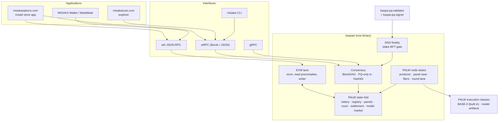

# MISAKA architecture overview

**This page describes MISAKA as it is now.** The [ADRs](../adr/README.md) record *how* it got here:
every decision, including the ones later reversed. Read this page first, and follow a link into an
ADR only when you need the reasoning behind a rule. Each topic below links **only the ADRs that
currently govern it**. Superseded ones are named once, so you can recognise them when older
documents cite them.

"Now" means **testnet-12** at release commit `0e8ec984e` (see [Release status](../../README.md#release-status)).
testnet-12 arms every consensus rule this binary knows at DAA 0 (`palw_t12_arm_every_rule_from_genesis`
in `consensus/core/src/config/params.rs`). The exceptions are one rule that arms at DAA 1,000 (bond
maturity) and six that stay dormant because consensus refuses them or they cannot be built
(`palw_inactivity_leak`, `palw_frontier_provenance`, `palw_beacon_fold`, `palw_shard_licensing`,
`palw_fp_decode_rules`, `palw_fp_decode_constraint`). So a rule that was "scheduled" or "dormant" on
testnet-11 is live here, from genesis.

> [!WARNING]
> **Two gaps in the record.**
> * **ADR-0152 is not in the repository.** It is R-core+ v3.1, the design testnet-12 runs: account
>   stake, the staged reserve, vested rewards, the stake-weighted panel draw and the Activation
>   Pool. The launch note, the launch checklist and many code comments cite it. Until it is
>   committed, the code in `consensus/core/src/config/params.rs` (`palw_rcore_plus`) and the
>   [launch note](../t12-launch-2026-09-25.md) are the only written record of it.
> * **The [ADR index](../adr/README.md) is not current past ADR-0149.** Its activation map is
>   testnet-11's. The topic map below is the current view.

## 1. The system in one picture

**Read it as layers.** The consensus core is Kaspa's BlockDAG with every signature, address and hash
made post-quantum. On top of that core, the **PALW state fold** decides who may produce a block
(a lottery over verified inference), who checks the work (panels of bonded seats), how a lie is
proven (the court), when work is paid (settlement), and it runs the **model market**. The
**EVM lane** is a window into that fold and a hand that writes to it, not a second source of truth.
**DNS finality** is a stake vote layered on top: it can veto a reorg, but PALW settlement does not
wait for it. Every consensus rule runs inside the one `kaspad` binary. Validators and the remote
signer are separate processes.

## 2. Protocol map: what governs each part

### 2.1 Post-quantum transactions and identity
Transactions are authorized only by ML-DSA-87. Addresses are keyed BLAKE2b-512 hashes of the
verification key. Every consensus identity (block, txid, merkle roots, UTXO commitment) is a
64-byte `Hash64`. secp256k1 is not linked into the node.
- **Governing:** [0019](../adr/0019-mldsa87-migration.md) ML-DSA-87 migration · [0002](../adr/0002-mldsa65-p2pkh.md) P2PKH structure (its ML-DSA-65 scheme is superseded by 0019) · [0008](../adr/0008-hash64-consensus-identity.md) Hash64 identity · [0003](../adr/0003-lthash-utxo-accumulator.md) LtHash UTXO accumulator · [0004](../adr/0004-utxo-commitment64.md) 64-byte UTXO commitment · [0005](../adr/0005-mass-policy.md) mass / DoS policy · [0006](../adr/0006-rpc-wasm-sdk-types.md) RPC / WASM / SDK types
- **Spec:** [kaspa-pq-spec.md](../kaspa-pq-spec.md), [kaspa-pq-design-mldsa87.md](../kaspa-pq-design-mldsa87.md)
- **Code:** `crypto/hashes/src/hash64.rs`, `crypto/addresses/`, `crypto/txscript/`, `consensus/core/src/mldsa87_primitives.rs`, `consensus/core/src/hashing/`

### 2.2 Block production: the PALW lottery and the clock
A block is won by a lottery over verified inference, not by hashing. One network-wide work target
`W` prices one unit of work from any model. A model's share is an *output* of the draw, not an
input to it. Heartbeats keep the DAA clock moving when nothing is produced, but they never outweigh
bonded work. The cadence is frozen at 120 s.
- **Governing:** [0038](../adr/0038-palw-is-the-consensus-work.md) PALW is the consensus work · [0039](../adr/0039-palw-only-block-production.md) PALW-only block production · [0042](../adr/0042-palw-mainnet-candidate-ruleset.md) one ruleset, one fork choice · [0058](../adr/0058-palw-merged-work-is-counted.md) merged work is counted · [0060](../adr/0060-the-liveness-doctrine.md) the liveness doctrine · [0072](../adr/0072-the-ticket-is-the-execution.md) the ticket is the execution · [0083](../adr/0083-the-difficulty-window-counts-only-rows-priced-by-bits.md) the difficulty window counts only rows priced by `bits` · [0105](../adr/0105-a-heartbeat-never-turns-a-bonded-block-red.md) a heartbeat never turns a bonded block red · [0117](../adr/0117-a-draw-is-one-forward.md) a draw is one forward · [0137](../adr/0137-a-block-buys-one-unit-of-work-from-any-model-and-a-share-is-a-result-not-an-input.md) one unit of work from any model · [0138](../adr/0138-the-daa-score-is-the-anchors-clock.md) the DAA score is the anchor's clock · [0142](../adr/0142-the-consensus-clock-is-a-cursor-a-heartbeat-consumes-a-slot.md) the clock is a cursor · [0149](../adr/0149-an-attempts-pwu-is-the-derivation.md) an attempt's pwu is the derivation · [0151](../adr/0151-liveness-is-structural-collateral-covers-fraud.md) liveness is structural
- **Superseded, often cited:** 0021 and 0036 D4 → [0039](../adr/0039-palw-only-block-production.md) · 0066 D2 (slot rule) → [0142](../adr/0142-the-consensus-clock-is-a-cursor-a-heartbeat-consumes-a-slot.md) · 0054, 0076, 0107 and 0135 D5 (share as a lottery input) → [0137](../adr/0137-a-block-buys-one-unit-of-work-from-any-model-and-a-share-is-a-result-not-an-input.md)
- **Open on testnet-12:** the heartbeat-transparency double spend (CRITICAL, fix pending, [launch note §2](../t12-launch-2026-09-25.md))
- **Code:** `consensus/core/src/palw_attempt_v2.rs`, `palw_work_target_v1.rs`, `palw_heartbeat_v1.rs`, `palw_clock_cursor_v1.rs`, `palw_fork_choice.rs`; node side `kaspad/src/palw_producer.rs`, `palw_heartbeat_miner.rs`

### 2.3 Verification: panels, seats, receipts
A claim is re-executed by a panel of bonded seats drawn from other operators. Each seat files a
signed receipt, which is evidence and not a vote. Seats must prove they hold a model's artifact
before they are counted. The panel is paid out of the claim's reward, and a seat carries exposure
for what it attests.
- **Governing:** [0028](../adr/0028-palw-challenge-sampling-protocol.md) sampling is a scheduler · [0098](../adr/0098-the-panels-coverage-is-a-number-and-a-seat-that-found-a-lie-files-nothing-else.md) coverage is a number · [0099](../adr/0099-the-adder-measures-the-chain-recomputes-and-a-seat-holds-a-shard.md) a seat holds a shard · [0108](../adr/0108-an-extension-is-a-manifest-the-verifier-recomputes-and-a-receipt-is-evidence-not-a-vote.md) a receipt is evidence, not a vote · [0111](../adr/0111-a-seat-may-demand-the-committed-leaf-it-needs-to-judge.md) a seat may demand the committed leaf · [0124](../adr/0124-the-panel-is-paid-out-of-the-claims-reward-a-seat-holds-exposure-and-a-claim-is-paid-for-the-compute-it-certifies.md) the panel is paid out of the claim · [0130](../adr/0130-bps1-is-hardened-before-it-is-widened.md) BPS 1 hardened (λ = 5 on testnet-12) · [0133](../adr/0133-verification-is-its-own-clock-a-class-verifies-over-spans-and-a-starved-class-stops-only-itself.md) verification on its own clock · [0135](../adr/0135-a-model-is-data-the-permissionless-registry-derives-its-profile-proves-its-panel-and-walks-its-lifecycle.md) the panel is proven · [0147](../adr/0147-independence-is-drawn-not-declared.md) independence is drawn · ADR-0152 (not committed) stake-weighted draw, readiness horizon 24
- **Open on testnet-12:** panel-seed grinding (CRITICAL, fence within 36 h of launch), and licences stuck behind claim-id order (V04) ([launch note §2](../t12-launch-2026-09-25.md))
- **Code:** `consensus/core/src/palw_panel_v2.rs`; node side `kaspad/src/palw_panel.rs`, `palw_receipt_pool.rs`, `palw_readiness_escalation.rs`

### 2.4 Disputes: the court and slashing
A licensed claim can still be disputed. A dispute bisects the execution down to one arithmetic step
and adjudicates that step. A data-availability court covers withheld material. A proven lie slashes
the bond behind it.
- **Governing:** [0026](../adr/0026-palw-v2-runtime-separated-verification.md) runtime-separated verification · [0027](../adr/0027-palw-slash-unilateral-fraud-proofs.md) unilateral fraud proofs · [0049](../adr/0049-palw-adjudication-contract.md) the adjudication contract · [0053](../adr/0053-palw-one-execution-family.md) one execution family, the court is not optional · [0062](../adr/0062-data-availability-court.md) data-availability court · [0065](../adr/0065-a-bond-must-be-earned-and-a-seat-must-be-someone-else.md) a bond must be earned, a seat must be someone else · [0069](../adr/0069-e2e-adjudicability-is-the-price-of-weight.md) end-to-end adjudicability is the price of weight · [0082](../adr/0082-the-close-is-flat-in-the-context.md) k-ary court · [0092](../adr/0092-the-ladder-is-minted-once-and-the-clock-is-what-binds.md) the ladder is minted once · [0100](../adr/0100-a-model-is-data-and-the-court-the-measure-and-the-licence-are-built-for-a-shard.md) a model is data, the court is built for a shard · [0119](../adr/0119-a-held-class-is-walked-at-the-regimes-ladder-and-the-chain-records-which-classes-those-are.md) held classes on the regime's ladder · ADR-0152 (not committed) offence attribution, held-class court
- **Superseded, often cited:** 0051 → [0053](../adr/0053-palw-one-execution-family.md)
- **Code:** `consensus/core/src/palw_court_v2.rs`, `palw_shard_court_v1.rs`, `palw_da_rcore_v1.rs`, `palw_offence_v1.rs`, `palw_slash.rs`; node side `kaspad/src/palw_reporter_filer.rs`, `palw_filer_*.rs`

### 2.5 Settlement and rewards
PALW settles on its own anchors. A claim becomes `Final` after its challenge window, and only then
is it paid. The block subsidy is split between the producing claim's escrow, the panel and the
validators. The only reward surface is inference someone was going to run anyway.
- **Governing:** [0059](../adr/0059-the-10b-premine-cap.md) the premine cap · [0091](../adr/0091-the-reward-buys-the-pair-and-no-holder-is-paid.md) the reward buys the pair and no holder is paid · [0124](../adr/0124-the-panel-is-paid-out-of-the-claims-reward-a-seat-holds-exposure-and-a-claim-is-paid-for-the-compute-it-certifies.md) the panel is paid out of the claim · [0126](../adr/0126-the-validator-carve-drops-to-a-fifth-and-the-stake-reorg-gate-stays.md) the validator carve is a fifth · [0127](../adr/0127-palw-settles-on-its-own-and-its-terms-are-not-dns-terms.md) PALW settles on its own · [0132](../adr/0132-what-a-model-is-actually-paid-per-forward-it-ran-and-why-the-gap-is-liveness-before-it-is-price.md) what a model is paid per forward · [0144](../adr/0144-palw-pays-for-the-inference-you-were-going-to-run-anyway.md) PALW pays for the inference you were going to run anyway · [0145](../adr/0145-canonical-work-is-derived-and-admission-is-earned.md) canonical work is derived, admission is earned · [0146](../adr/0146-a-coefficient-is-justified-by-the-arbitrage-it-permits.md) a coefficient is justified by the arbitrage it permits · [0148](../adr/0148-the-free-prompt-lane-prices-compute.md) the free-prompt lane prices compute · ADR-0152 (not committed) vesting and the staged reserve
- **Superseded, often cited:** 0018 §F's 30 % validator share → [0126](../adr/0126-the-validator-carve-drops-to-a-fifth-and-the-stake-reorg-gate-stays.md) · 0073 D2 (self-prompt) withdrawn by [0144](../adr/0144-palw-pays-for-the-inference-you-were-going-to-run-anyway.md)
- **Code:** `consensus/core/src/palw_settlement_v1.rs`, `palw_reward_v2.rs`, `palw_vesting_v1.rs`, `palw_economic_payout_v1.rs`

### 2.6 Bonds, collateral and stake
Producing, sitting on a panel and validating each need a bond the chain holds. Collateral is sized
to cover the gain from fraud, not to buy liveness. One key registers one bond for the life of the
chain.
- **Governing:** [0016](../adr/0016-stake-locked-bond-utxos.md) stake-locked bond UTXOs · [0064](../adr/0064-trustless-recovery-from-a-total-stop.md) a bond is usable in the block that registers it · [0065](../adr/0065-a-bond-must-be-earned-and-a-seat-must-be-someone-else.md) maturity (testnet-12: DAA 1,000) · [0151](../adr/0151-liveness-is-structural-collateral-covers-fraud.md) collateral covers fraud · ADR-0152 (not committed) a bond is standing stake
- **Superseded, often cited:** [0061](../adr/0061-zero-seat-genesis-and-right-sized-collateral.md)'s collateral model → 0151 / 0152 on testnet-12
- **Code:** `consensus/core/src/palw_state_v2.rs` (bond rows), `misaka-cli` (`misaka bond`)

### 2.7 Model registry and class lifecycle
A model is chain data. Anyone may register a class, and its profile is derived from its graph. It
walks a lifecycle (`Candidate` → `Prefetching` → `Active`), and it pays only once a panel can
verify it. An artifact root has one owner.
- **Governing:** [0067](../adr/0067-classes-are-chain-data-kernels-are-the-build.md) classes are chain data · [0075](../adr/0075-certification-is-a-consensus-object.md) certification is a consensus object · [0103](../adr/0103-the-context-is-held-off-the-chain-and-the-chain-carries-a-root-an-opening-and-a-logarithm.md) held context · [0118](../adr/0118-the-held-regime-arrives-at-a-height-and-a-held-class-carries-its-own-prompt-form.md) the held regime · [0135](../adr/0135-a-model-is-data-the-permissionless-registry-derives-its-profile-proves-its-panel-and-walks-its-lifecycle.md) the permissionless registry and lifecycle · [0143](../adr/0143-an-artifact-root-has-one-owner-on-the-chain.md) an artifact root has one owner · [0147](../adr/0147-independence-is-drawn-not-declared.md) independence is drawn · ADR-0152 (not committed) the Activation Pool and class verify deadline
- **Superseded, often cited:** 0053's catalogue rule, re-scoped by [0067](../adr/0067-classes-are-chain-data-kernels-are-the-build.md) · 0069 D2/D5/D6 and 0044's in-build certified set → [0075](../adr/0075-certification-is-a-consensus-object.md)
- **Code:** `consensus/core/src/palw_model_registry_v1.rs`, `palw_class_admission_v2.rs`, `palw_activation_pool_v1.rs`; operator guide [palw-add-a-model-runbook.md](../palw-add-a-model-runbook.md)

### 2.8 Model market: stores and memberships
Every model line can have a store, run by consensus. The store is opened by a locked deposit. Whole
memberships are bought from the line's curve and sold back to it, never transferred. Every move
burns 5 % and pays the owner 5 %. Part of each reward for a model's work buys into its curve. No
holder is ever paid. The app is [misakaoptions.com](https://misakaoptions.com).
- **Governing:** [0087](../adr/0087-a-position-is-bought-from-the-curve-and-sold-back-to-it.md) bought from the curve, sold back to it · [0088](../adr/0088-the-class-keeps-its-graph-and-the-owner-keeps-publishing.md) the owner keeps publishing · [0089](../adr/0089-the-fold-is-the-truth-and-the-evm-is-its-window-and-its-hand.md) the fold is the truth, the EVM its window · [0090](../adr/0090-the-pair-is-seeded-with-real-msk-locked-for-good-and-a-position-is-whole.md) a real, locked seed, whole positions · [0091](../adr/0091-the-reward-buys-the-pair-and-no-holder-is-paid.md) no holder is paid · [0094](../adr/0094-a-seed-is-paid-in-as-many-transactions-as-it-takes.md) a seed in as many transactions as it takes · [0095](../adr/0095-a-position-is-a-membership-not-an-income.md) a position is a membership, not an income · [0101](../adr/0101-a-membership-is-proven-by-the-chain-and-served-by-anyone-and-a-position-never-moves.md) a membership is proven by the chain · [0114](../adr/0114-the-owners-leg-is-five-percent-and-it-arrives-at-a-height.md) the owner's leg is 5 % · [0120](../adr/0120-the-least-seed-is-one-million-msk-and-it-arrives-at-a-height.md) the least seed is 1,000,000 MSK
- **Superseded, often cited:** 0087's 1 % leg → [0114](../adr/0114-the-owners-leg-is-five-percent-and-it-arrives-at-a-height.md) · 0090's 100,000 MSK least seed → [0120](../adr/0120-the-least-seed-is-one-million-msk-and-it-arrives-at-a-height.md)
- **Code:** `consensus/core/src/palw_model_market_v1.rs`, `palw_model_lines_v1.rs`, `palw_model_benefits_v1.rs`, `consensus/core/src/evm/model_market.rs`, `kaspa-evm/src/model_market.rs`, `contracts/misaka-model/` (interfaces), app `web/misaka-options/`

### 2.9 Execution lane and EVM lane
The EVM lane executes on the selected-parent chain and reads and writes the PALW fold through
precompiles. Round blocks carry transactions between the 120-second PALW blocks. They add no
confirmations: a payment is as final as the settled anchors after it.
- **Governing:** [0020](../adr/0020-selected-parent-evm-lane.md) the selected-parent EVM lane (its "opt-in" wording is stale) · [0022](../adr/0022-pruned-ibd-evm-overlay-snapshot.md) pruned-IBD EVM overlay snapshot · [0089](../adr/0089-the-fold-is-the-truth-and-the-evm-is-its-window-and-its-hand.md) the fold is the truth · [0109](../adr/0109-a-lock-is-its-own-claim-and-finality-is-a-label-not-a-pause.md) a lock is its own claim · [0115](../adr/0115-a-pending-transaction-is-announced-until-it-lands.md) a pending transaction is announced until it lands · [0125](../adr/0125-the-execution-lane-is-a-second-lane-inside-the-cadence-and-it-widens-one-permit-at-a-time.md) the execution lane · [0129](../adr/0129-a-double-spend-needs-the-anchors-not-the-blocks.md) a double spend needs the anchors · [0139](../adr/0139-the-execution-lanes-gas-is-one-budget-a-round.md) gas is one budget a round
- **Code:** `kaspa-evm/`, `consensus/core/src/evm/`, `consensus/src/processes/evm/mod.rs` (includes the bridge ledger), `rpc/eth/`, `evm-indexer/`; node side `kaspad/src/palw_round_producer.rs`

### 2.10 Finality
DNS finality is a vote. Validators holding more than two thirds of the counted bonded stake attest
to an anchor and precommit to it, and the stake reorg gate then refuses chains that abandon it.
PALW payments settle on PALW anchors and do not wait for it. On testnet-12 DNS finality stays in
Bootstrap until validators are funded.
- **Governing:** [0009](../adr/0009-dns-probabilistic-finality.md) the finality overlay and reorg gate · [0013](../adr/0013-validator-reward-distribution.md) validator reward distribution · [0017](../adr/0017-all-active-staker-attestation.md) all-active-staker attestation · [0126](../adr/0126-the-validator-carve-drops-to-a-fifth-and-the-stake-reorg-gate-stays.md) the stake reorg gate stays · [0127](../adr/0127-palw-settles-on-its-own-and-its-terms-are-not-dns-terms.md) PALW's terms are not DNS terms · [0128](../adr/0128-dns-validators-vote-bft-by-bonded-stake-and-that-vote-decides-the-stake-reorg-gate.md) validators vote BFT by bonded stake · [0134](../adr/0134-the-compute-overlays-committee-beacon-retires-at-a-height-and-its-machinery-goes.md) the compute overlay retires
- **Superseded, often cited:** 0012 → [0017](../adr/0017-all-active-staker-attestation.md) · the VLT voting weight of 0024 → [0128](../adr/0128-dns-validators-vote-bft-by-bonded-stake-and-that-vote-decides-the-stake-reorg-gate.md)
- **Not in any ADR:** the "finality depth 600 blue" in the launch note is derived in code from the challenge window
- **Code:** `consensus/core/src/dns_finality.rs`, `dns_bft_v1.rs`, `kaspa-pq-validator/`, `kaspa-pq-validator-core/`, `kaspa-pq-signer/`; runbook [validator-runbook.md](../validator-runbook.md)

### 2.11 Free prompts
A prompt a person would type can become a claim the court can try. The gateway is OpenAI-compatible
and serves on localhost only for now.
- **Governing:** [0044](../adr/0044-palw-free-prompt-receipts.md) free-prompt receipts · [0077](../adr/0077-a-prompt-a-person-would-type-is-a-claim-the-court-can-try.md) Phase A · [0096](../adr/0096-the-app-you-already-use-is-the-entrance-and-the-shape-of-the-answer-is-committed.md) the app you already use is the entrance · [0144](../adr/0144-palw-pays-for-the-inference-you-were-going-to-run-anyway.md) the constitution · [0148](../adr/0148-the-free-prompt-lane-prices-compute.md) the free-prompt lane prices compute
- **Code:** `consensus/core/src/palw_freeprompt_v3.rs`, `misaka-palw-gateway/`, `misaka-palw-fp-submit/`, `misaka-palw-constraint/`

### 2.12 Network identity and upgrades
Each network is isolated. A node announces a consensus params fingerprint that hashes every
scheduled rule, and a peer on a different ruleset is refused at the handshake. Rules change
through activation fences at DAA heights. testnet-12 arms them at 0.
- **Governing:** [0001](../adr/0001-network-isolation.md) network isolation · [0025](../adr/0025-chain-participation-and-ibd-candidate-selection.md) chain participation and IBD candidate selection · [0042](../adr/0042-palw-mainnet-candidate-ruleset.md) one fingerprint, RC == mainnet · [0072](../adr/0072-the-ticket-is-the-execution.md) §3 the activation shape · [0150](../adr/0150-the-fingerprint-must-see-the-rule-not-only-the-height.md) the fingerprint must see the rule · [0122](../adr/0122-mining-is-a-purpose-an-operator-runs-one-command-and-reads-one-work-id.md) the operator CLI
- **Not in any ADR:** the fork-id handshake (`fork_id_v1`), the clock lead cap and operator-id uniqueness are audit-driven fences
- **Code:** `consensus/core/src/config/params.rs` (every network's parameters and fences), `kaspad/src/daemon.rs` (the startup identity lines), `protocol/`

## 3. Code map

The workspace has 94 crates. They sit side by side at the repository root because Cargo does not
care about hierarchy, but they fall into six groups. Directory names are unchanged from upstream
where they came from Kaspa (`kaspa-*`).

### Core: consensus, crypto, storage, RPC (inherited from Kaspa, made PQ-only)
| path | what it is |
|---|---|
| `consensus/`, `consensus/core/` | the BlockDAG consensus. `consensus/core/src/palw_*` holds every PALW rule (state fold, lottery, registry, panels, court, settlement, model market) and `config/params.rs` every network's parameters |
| `crypto/` | `hashes` (Hash64, BLAKE2b-512), `addresses`, `txscript` (ML-DSA-87 checksig), `muhash`, `merkle` |
| `database/`, `indexes/` | RocksDB storage and the UTXO index |
| `protocol/`, `components/` | P2P library and flows, address, connection and consensus managers |
| `rpc/` | `core`, `service`, gRPC and wRPC servers and clients, `eth` (Ethereum JSON-RPC adapter) |
| `mining/`, `notify/`, `core/`, `math/`, `utils/`, `metrics/` | mempool and block templates, notifications, shared utilities |

### PALW execution and verification
| path | role |
|---|---|
| `misaka-palw-base0/` | **live**: PALW-BASE-0, the integer floor class, built into `kaspad`, plus certification and conversion tools |
| `misaka-palw-sdk/` | **live**: the one interface every model class passes through, plus the `palw-class` binary |
| `misaka-palw-base0-ref2/`, `misaka-palw-reference2/` | **reference**: independent second implementations used by tests to check the canonical arithmetic |
| `misaka-palw-derive/`, `misaka-palw-extension/` | **operator tools**: derived artifacts and extension manifests |
| `misaka-palw-gateway/`, `misaka-palw-fp-submit/`, `misaka-palw-constraint/` | **operator services**: the free-prompt gateway and its submit path |
| `tools/palw-job-replay/`, `tools/palw-jobs-export/` | **operator tools**: replay a job on this machine, export jobs for the explorer |
| `misaka-palw/`, `misaka-palw-worker/`, `misaka-palw-agent/`, `misaka-palw-pow-driver/` | **legacy**: the V1 worker runtime and PoW tag path. The worker is excluded from default builds, and no registered class runs on it |
| `misaka-palw-reexecutor/`, `misaka-palw-shadow/` | **drill / legacy**: Stage-0 capability agent and shadow drill, consensus-inert |

### Node and operator binaries
| path | what it is |
|---|---|
| `kaspad/` | the full node: consensus, PALW duties, EVM lane, RPC, in-process validator |
| `misaka-cli/` | `misaka`, the operator CLI: node, keys, bond, mining, model, position, EVM |
| `kaspa-pq-validator/`, `kaspa-pq-validator-core/`, `kaspa-pq-signer/` | DNS-finality validator sidecar, its signing primitives, the remote signer |
| `misaka-dnsseeder/`, `misaka-endpoints/` | DNS seeder, and the local endpoint registry |
| `pq-miner/`, `misaminer/`, `bridge/` | **legacy**: Layer-0 hash miners and the stratum bridge. They cannot mine a PALW network (no attempt envelope) |
| `rothschild/`, `simpa/`, `daemon/` | transaction generator, network simulator, desktop daemon wrapper (from Kaspa) |

### Applications and integrations
| path | what it is |
|---|---|
| `web/misaka-options/` | [misakaoptions.com](https://misakaoptions.com), the model store app |
| `contrib/misakascan-t12/` | the explorer front end at [misakascan.com](https://misakascan.com) |
| `kaspa-evm/`, `evm-indexer/`, `contracts/`, `examples/evm/` | the EVM executor, the token-transfer indexer, Solidity interfaces (model market, PQ smart account, NFT) and a Foundry sample |
| `wallet/`, `wasm/` | wallet library, CLI wallet and PQ key tools, and the WASM SDK |

### Development, release and operations
| path | what it is |
|---|---|
| `testing/` | the workspace integration tests and soak scripts |
| `scripts/` | CI gates (`ci-gates.sh`), release smoke and summary scripts, re-pin tools, devnet drills, simulators |
| `contrib/t12-deploy-kit/`, `contrib/t12-drill-kit/` | testnet-12 fleet deployment and post-launch drills |
| `docker/`, `deploy/`, `musl-toolchain/` | Dockerfiles, systemd units, the static musl toolchain |
| `.github/workflows/` | CI (`ci.yaml`) and the release (`deploy.yaml`, [release-process.md](../release-process.md)) |
| `release.json` | the identity the next release must print |

## 4. Where to go next

| you want to… | read |
|---|---|
| run a node, produce blocks | [testnet12-join-mining.md](../testnet12-join-mining.md) |
| run a validator | [validator-runbook.md](../validator-runbook.md) |
| know what is left before mainnet | [mainnet-readiness.md](../mainnet-readiness.md) |
| read the reasoning behind a rule | the ADR linked above, and the [ADR index](../adr/README.md) |
| check the byte-level PQ spec | [kaspa-pq-spec.md](../kaspa-pq-spec.md) |
| see how the provenance fields map to code | [palw-registry-map.md](../palw-registry-map.md) |
| read testnet-11's history | [history/testnet-11.md](../history/testnet-11.md) |

**Keep this page current.** When an ADR is accepted, superseded or armed, update its topic here in
the same PR. This page is the current view, and an out-of-date current view is worse than none.
